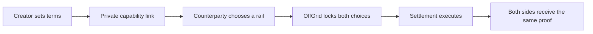

<div align="center">

# OffGrid

### Money without borders.

**Pay with the balance you have. Let the other person receive it the way they want.**

[Live Testnet App](https://off-grid-theta.vercel.app/) · [Detailed Walkthrough](walkthrough.md) · [Architecture](docs/ARCHITECTURE.md) · [Request a Video](https://github.com/0xmugetso/off-grid/issues/new?title=Video%20walkthrough%20request)

</div>


<sub>Account names and wallet identifiers in documentation screenshots are intentionally obscured.</sub>

OffGrid is a testnet payment workspace for direct transfers, private payment sessions, cross-chain USDC, team payouts, and protected work. It brings wallet balances, Circle Gateway, CCTP, fiat sandbox rails, receipts, and transaction proof into one interface.

The idea is simple: the payer chooses how to fund a payment, the receiver chooses how to receive it, and OffGrid coordinates the route without taking custody of a connected wallet.

> OffGrid is currently a testnet product. Crypto flows use testnet assets. Fiat flows use Circle's sandbox and do not move real bank money.

## Why OffGrid

Global payments often force both sides into the same provider, network, or payout method. OffGrid separates those choices.

- Pay from an Arc Testnet wallet, a Circle Gateway balance, another supported testnet through CCTP, or a fiat sandbox balance.
- Receive testnet USDC or complete a simulated bank payout flow.
- Prepare and track many team payments in one run.
- Protect client and worker agreements with onchain escrow and verifiable evidence.
- Finish each completed flow with a receipt backed by provider IDs or transaction hashes.

## Product tour

| Area | What it is for | What proves the result |
| --- | --- | --- |
| **Transfer** | Send directly or open a private two-party payment session | Wallet hash, Gateway operation, CCTP proof, or Circle sandbox references |
| **History** | Search, filter, recover, and inspect submitted activity | Canonical hashes, provider IDs, explorer links, and protocol logs |
| **Unified Balance** | Deposit USDC from supported testnets and view one Gateway position | Live Circle Gateway balances and persisted deposit tracking |
| **Mass Payment** | Pay multiple recipients with equal or individual amounts | One proof and receipt for every submitted transfer |
| **Escrow Market** | Post work, invite a user, lock funds, and settle approved delivery | RefundProtocol contract, funding, evidence, and release or refund proof |
| **Agent Payments** | Reserved for automated payment workflows | Coming soon |

## Compact walkthrough

This is the shortest path from a new account to a verified payment. The [full walkthrough](walkthrough.md) covers every tab, rail, waiting state, and recovery tool.

### 1. Create an account

Open the [live app](https://off-grid-theta.vercel.app/), keep the suggested username or generate another one, and connect an EVM wallet. Sign the SIWE message to create or reopen your account. The signature proves wallet ownership and does not send a transaction.

**Privacy:** OffGrid has no account passwords. The signed session is stored in an `HttpOnly`, `SameSite=Lax` cookie.


### 2. Prepare a testnet wallet

Use **Switch to Arc Testnet** when the connected wallet is on another network. **Get Test USDC** opens Circle's faucet. Refresh balances after funding.

You may also connect a Solana wallet when testing Solana Devnet deposits or bridges. Solana is a payment signer, not the identity used to access the OffGrid account.

### 3. Send a direct payment

Open **Transfer**, search for an OffGrid username or paste an EVM address, enter the amount, and choose a funding source:

- **Direct Wallet:** send USDC from the connected Arc Testnet wallet.
- **Unified Balance:** spend confirmed USDC held through Circle Gateway.
- **CCTP Bridge:** move USDC from a supported source testnet to Arc Testnet.
- **Fiat to Web3:** run the Circle Mint sandbox flow and complete the payout with testnet USDC.

Review the route, sign when required, and wait for its proof. Rejected wallet prompts and failed preflight checks are not recorded as completed transactions.

### 4. Open a private payment session

Select **Create Payment Session**, choose whether you are paying or receiving, set the amount and your preferred rail, then copy the private link. The other person signs in, opens the link, and chooses their side of the route. OffGrid locks both choices before settlement begins.

The session updates both participants as actions complete. Web3-to-Web3 sessions move the payer to a prefilled transfer form. Fiat combinations show each provider and onchain checkpoint instead of jumping directly to success.

**Privacy:** the link contains a random capability token, not the amount, direction, participants, or payment choices. Session lookup uses its SHA-256 hash. The capability itself stays server-side so the creator can reopen the exact link. After the intended counterparty claims it, unrelated accounts cannot enter.

### 5. Follow the proof

Open **History** to inspect active and completed routes. Search or filter the ledger, open explorer proof, and recover a missing CCTP transfer or Gateway deposit from its source transaction.

Long-running deposits and bridges continue tracking after refresh. A status only becomes confirmed after OffGrid has a provider reference or a verified transaction hash.

### 6. Use the other workspaces

- **Unified Balance:** deposit from a supported testnet, watch source-chain finality, and see confirmed value by chain.
- **Mass Payment:** build a roster, choose equal or custom amounts, select Direct Wallet or Unified Balance, and follow each recipient separately.
- **Escrow Market:** post public work or send a private invite, accept the job, fund RefundProtocol, submit evidence, and follow the onchain release or refund.

### 7. Share the receipt

Completed flows create a shared receipt with the amount, participants, route, timestamp, reference, and strongest available proof. Open the explorer, copy the receipt URL, or download a clean image.


## One payment, two choices

Private sessions are the center of OffGrid:



The URL cannot change the payment terms. The server remains the source of truth for the amount, participants, direction, rails, and current settlement state.

## Settlement paths

### Direct Wallet

The payer signs a USDC transfer with the connected wallet on Arc Testnet. OffGrid prepares the transaction and watches for a confirmed hash. It never receives the wallet's private key and cannot sign for the user.

### Circle Gateway Unified Balance

Users can deposit testnet USDC from Base Sepolia, Arbitrum Sepolia, Ethereum Sepolia, Solana Devnet, and Arc Testnet into Circle Gateway. App Kit returns the unified spendable position and selects confirmed source balances when a user spends.

Gateway deposits can remain pending while the source chain reaches Circle's required finality. OffGrid keeps each submitted deposit in History so closing the modal or starting another payment does not erase it.


### CCTP V2

OffGrid uses Circle App Kit to burn USDC on a supported source testnet and mint it on Arc Testnet. Submitted transfers persist across refreshes. History keeps the source burn, Circle attestation state, and destination mint status together.

### Fiat Sandbox

Fiat-to-Web3 and Web3-to-Fiat sessions use Circle Mint's sandbox plus a pre-funded developer-controlled testnet wallet. The UI shows the wire reference, deposit or payout ID, wallet transaction ID, and final onchain proof as each stage completes.

This is a product demonstration, not a real bank transfer. Production fiat payouts require a licensed provider, supported bank accounts, KYC or KYB checks, sanctions screening, and operational reconciliation.

## History that shows proof

History is a record of submitted activity, not a list of button clicks. Users can:

- search by participant, route, or transaction ID;
- filter and sort settlement activity;
- open canonical source or destination transactions in an explorer;
- inspect Circle sandbox and Gateway references;
- restore a missing CCTP transfer from its source burn hash;
- restore a Gateway deposit from its chain, amount, and source transaction hash.


## Mass payments

Mass Payment turns a roster into a guided payout run.

- Add verified OffGrid users or any valid EVM wallet.
- Paste or import a `name, wallet, amount` list.
- Pay everyone the same amount or set individual amounts.
- Choose a direct wallet or confirmed Unified Balance.
- Review the total, sign, and follow each recipient independently.

Compatible wallets can receive an EIP-5792 batch request for direct payments. Other wallets use a clear sequential fallback. Gateway payouts use one documented spend per recipient. The interface never presents a group as complete when one recipient still lacks proof.


## Protected work

The Escrow Market extends Circle's RefundProtocol pattern into a public and private work flow.

1. A client posts a scoped job publicly or invites one verified account.
2. A worker accepts the agreement.
3. Circle developer-controlled smart contract accounts deploy and fund RefundProtocol on Arc Testnet.
4. The worker submits evidence against the agreed deliverables.
5. The configured AI validator records its decision.
6. Approved work releases USDC to the beneficiary path. Rejected or cancelled work follows the refund path.

The inspector keeps the contract address, payment reference, hashes, evidence digest, validation result, and protocol audit trail together. This implementation follows the sample lifecycle, then adds OffGrid's marketplace and evidence experience. It is a testnet extension, not a claim that the custom marketplace is part of Circle's official sample.

Read [the escrow implementation notes](docs/ARC_ESCROW.md) before testing this feature.

## Privacy and security choices

### Accounts and wallets

- Sign-In with Ethereum means there are no passwords to store or reset.
- Authentication nonces expire and cannot be reused.
- Sessions use an HMAC-signed `HttpOnly`, `SameSite=Lax` cookie.
- Wallets sign their own transactions. Seed phrases and private keys never enter OffGrid.
- Solana wallets connect as payment signers after EVM account authentication.

### Private sessions

- Invitation URLs use 256-bit random capability tokens.
- Session lookup uses a SHA-256 token hash. The raw capability remains server-side so the creator can reopen the exact link.
- Payment terms are never encoded in the URL.
- The first eligible counterparty claims the invitation. Everyone else receives an authorization error.
- Both participants see the same locked terms and receipt.

### Provider and payment data

- Server credentials remain in server-only environment variables, never `NEXT_PUBLIC_*` values.
- Success requires provider references or public transaction proof.
- Fiat test data stays in Circle's sandbox. Real bank details are outside the current product scope.
- Webhook requests are verified before they can update payment state.

### Storage

- Local development uses `.data/offgrid.json` with restricted file permissions.
- Hosted deployments use PostgreSQL through the same storage boundary.
- The current model is suitable for a testnet prototype. Production still needs a dedicated double-entry ledger, stronger key management, idempotent workers, monitoring, and an external security review.

## Testnet scope

| Capability | Current state |
| --- | --- |
| Arc Testnet wallet transfers | Real testnet transaction |
| Circle Gateway deposits and spends | Real testnet operation |
| CCTP V2 bridge | Real testnet burn, attestation, and mint |
| Solana Devnet source wallet | Real devnet connection and source action |
| Fiat rails | Circle sandbox simulation with provider proof and testnet payout |
| Escrow | Real testnet contract and token actions with a custom OffGrid workflow |
| Agent Payments | Coming soon |

## Run locally

### Requirements

- Node.js 22.14 or newer
- An EVM browser wallet such as Rabby or MetaMask
- Testnet USDC and source-chain gas for the routes you want to test
- PostgreSQL for hosted or multi-instance use

### Start

```bash
git clone https://github.com/0xmugetso/off-grid.git
cd off-grid
npm install
cp .env.example .env.local
npm run dev -- --port 3001
```

Open [http://localhost:3001](http://localhost:3001).

Generate a strong session secret:

```bash
openssl rand -base64 48
```

Place it in `SESSION_SECRET` inside `.env.local`. Never commit `.env.local`.

### Configuration levels

You do not need every provider key to explore the interface.

| Goal | Required configuration |
| --- | --- |
| Sign in and use direct wallet transfers | `SESSION_SECRET`, Arc RPC settings |
| Persist a hosted deployment | `DATABASE_URL` or a supported Postgres URL |
| Use Gateway and CCTP | Circle App Kit client configuration and supported wallet networks |
| Test fiat sessions | Circle Mint sandbox key, bank account ID, settlement wallet, and webhook secret |
| Test protected work | Circle API key, registered entity secret, escrow wallet, Smart Contract Platform access, and an AI provider |

Start with [.env.example](.env.example), then follow the [Vercel deployment guide](docs/VERCEL_DEPLOYMENT.md). Keep Circle API keys, entity secrets, database credentials, and AI provider keys on the server.

## Verify the project

```bash
npm test
npm run typecheck
npm run build
```

The prebuild step compiles the RefundProtocol artifact used by the escrow flow.

## Documentation

- [Detailed product walkthrough](walkthrough.md)
- [Architecture and trust boundaries](docs/ARCHITECTURE.md)
- [Arc and Circle alignment audit](docs/ARC_ALIGNMENT_AUDIT.md)
- [Payment session rails](docs/PAYMENT_SESSION_RAILS.md)
- [Escrow implementation](docs/ARC_ESCROW.md)
- [Fiat sandbox setup](docs/FIAT_SANDBOX.md)
- [SIWE and transaction history](docs/SIWE_AND_HISTORY_GUIDE.md)
- [Vercel deployment](docs/VERCEL_DEPLOYMENT.md)

## Video walkthrough

Want to see the complete flow before configuring the testnet stack? [Open a video walkthrough request](https://github.com/0xmugetso/off-grid/issues/new?title=Video%20walkthrough%20request&body=I%27d%20like%20a%20guided%20OffGrid%20walkthrough%20covering%3A%20%5Bfeature%20or%20flow%5D.). Mention the feature you want to see so the recording can focus on the right workflow.

## Built with

- Next.js 16, React 19, and TypeScript
- Circle App Kit with Viem and Solana adapters
- Circle Gateway and CCTP V2
- Circle Developer-Controlled Wallets and Smart Contract Platform
- Viem
- Neon or PostgreSQL

---

<div align="center">

**OffGrid is an experimental testnet product. Do not send mainnet assets or real bank information.**

</div>
