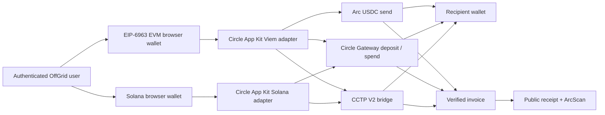
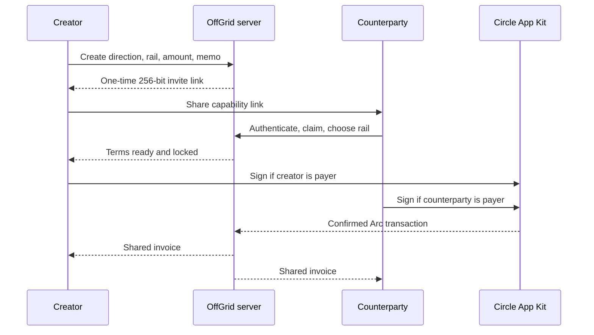

# OffGrid architecture

## Current local product

The browser holds the signer. OffGrid never receives a private key. Wallet connection, chain switching, fee estimation, and payment are separate user-visible stages so wallet prompts cannot overlap.

### Two-party sessions

- Invite tokens are generated from 32 random bytes and stored only as SHA-256 hashes.
- A GET never claims a session. Claiming requires an authenticated mutation from an account other than the creator.
- Once claimed, the capability is authorized only for the creator and bound counterparty.
- Direction, amount, memo, participant identity, and rails are canonical server state rather than URL parameters.
- The invoice mutation revalidates the payer, recipient wallet, amount, and both rails before completing the session atomically.

### Identity

- Passwords use Node `scrypt` with a unique random salt.
- Sessions are HMAC-signed, expire after fourteen days, and stay in HttpOnly, `SameSite=Lax` cookies.
- Usernames form a local recipient directory. Only accounts with a bound EVM address appear in search.
- `.data/offgrid.json` is an atomic, permission-restricted local store for offline development. When `DATABASE_URL`/`POSTGRES_URL` is present, the same server store boundary uses a hosted Postgres `offgrid_state` row with optimistic revision checks for concurrent Vercel invocations.

### Arc and Circle

- Arc Testnet chain ID: `5042002`.
- USDC ERC-20 interface: `0x3600000000000000000000000000000000000000`, 6 decimals.
- Native gas accounting uses 18 decimals, but it is the same underlying USDC pool. OffGrid never sums the two views.
- Direct payments call `estimateSend` before `send`.
- Gateway payments call `estimateSpend` before `spend`; deposits use `unifiedBalance.deposit`.
- Cross-chain payments call `estimateBridge` before `bridge`. The browser-wallet route supports Base Sepolia, Arbitrum Sepolia, Ethereum Sepolia, and Solana Devnet as CCTP V2 sources and uses the App Kit Forwarder-only Arc destination.
- CCTP standard transfer is the payroll default. App Kit owns approve and burn orchestration; Circle Forwarder retrieves the attestation and submits the Arc mint without requiring the page to remain open.
- The source burn lifecycle event is persisted in `cctpOperations` before the payment form is released. The authenticated status route polls Circle's testnet `/v2/messages/{sourceDomain}` endpoint and treats expected 404/pending responses as in-flight states.
- Iris responses are matched against destination domain 26, recipient, and six-decimal amount before an automatic invoice can be created. App Kit's submitted mint hash remains `minting`; only Iris `forwardState: COMPLETE` promotes the transfer into History.
- Multiple CCTP promises can run concurrently. Background lifecycle events are correlated with App Kit `traceId` values so an older transfer cannot overwrite the progress UI for a newer payment.
- CCTP receipts use the successful destination mint transaction as the canonical Arc proof and preserve transaction links for every bridge step.
- Payment activity is not created optimistically. A valid 32-byte transaction hash is required by the invoice API.

### Mass payment

- Direct Arc payroll prepares standard calls to the official six-decimal USDC ERC-20 interface.
- The Circle Viem adapter checks `wallet_getCapabilities`. When the wallet reports EIP-5792 atomic support on Arc, OffGrid submits the prepared calls through `batchExecute` / `wallet_sendCalls` and validates every returned receipt.
- When EIP-5792 is unavailable, the same prepared transfers execute sequentially. The UI states this before signing; it never claims unsupported wallets are atomic.
- Unified Balance currently exposes one recipient per `spend`, so mass Gateway payroll is an ordered set of real spends rather than a fake batch. Progress is reported per confirmed recipient.
- Recipient addresses must be unique, all amounts must pass six-decimal accounting, and a client run is capped at 50 recipients.
- Circle's Airdrop contract template is designed for developer-controlled smart contract accounts. OffGrid intentionally keeps its current browser-wallet, self-custodial flow separate from that custody model.

### Web2 boundary

Fiat payout cannot be truthfully live without a licensed off-ramp, credentials, supported jurisdictions, KYC/KYB, sanctions screening, and webhook reconciliation. The product exposes the boundary as unavailable rather than creating simulated delivery records. The existing signed webhook route is the integration seam for a configured provider.

### Escrow boundary

AI Escrow follows Circle's official `arc-escrow` architecture. OffGrid provisions participant Circle SCAs, deploys a dedicated `RefundProtocol` through Circle Smart Contract Platform, and persists every Circle transaction identifier. The depositor's Circle wallet approves USDC and calls `pay`; beneficiary image evidence is validated server-side and a HIGH-confidence result calls `withdraw([0])`. The beneficiary can instead call `refundByRecipient(0)`. Circle webhook signatures are verified and pending states are reconciled after refresh. See `docs/ARC_ESCROW.md` for hosted configuration and trust boundaries.

## Production migration

- The Vercel testnet deployment uses hosted Postgres for durable account, invoice, session, and CCTP state. Before handling real payroll volume, replace the JSON-shaped row with normalized PostgreSQL tables and a double-entry ledger.
- Use WebAuthn/passkeys or an audited identity provider, CSRF protection, login throttling, email verification, and session revocation.
- Encrypt payout data with a managed KMS and store provider tokens instead of bank details.
- Add durable queues, idempotency keys, an outbox, webhook replay protection, and three-way reconciliation.
- Add maker/checker approvals, transaction policies, compliance screening, and jurisdiction rules.
- Audit smart contracts and all custody/settlement boundaries before real funds are enabled.
