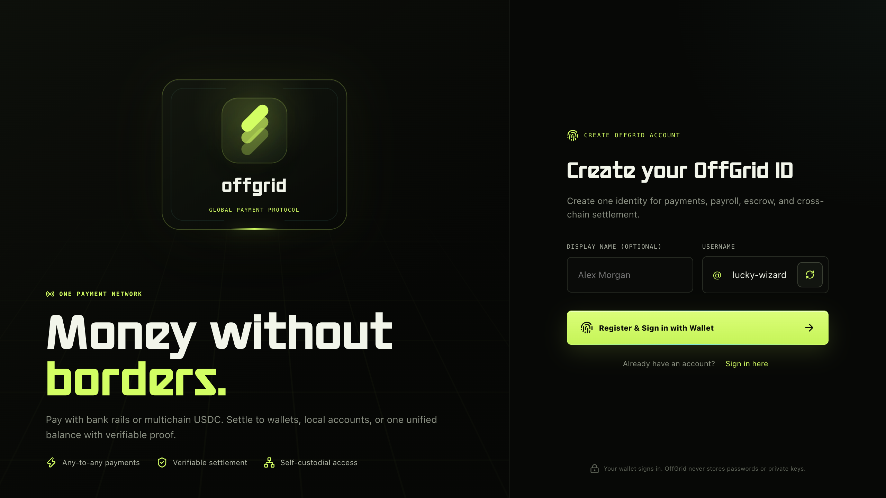
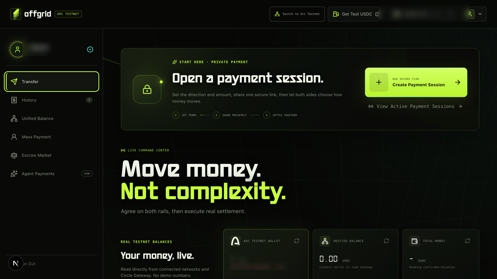
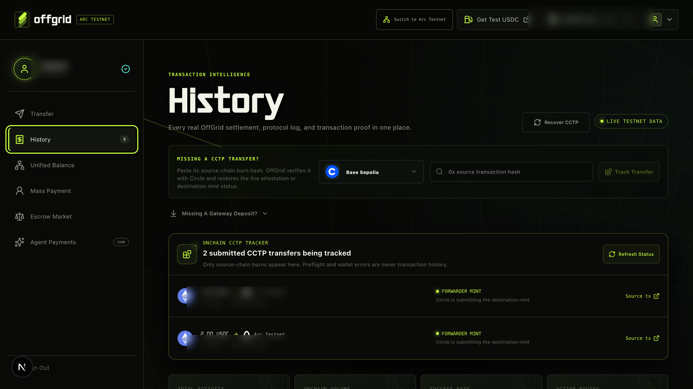
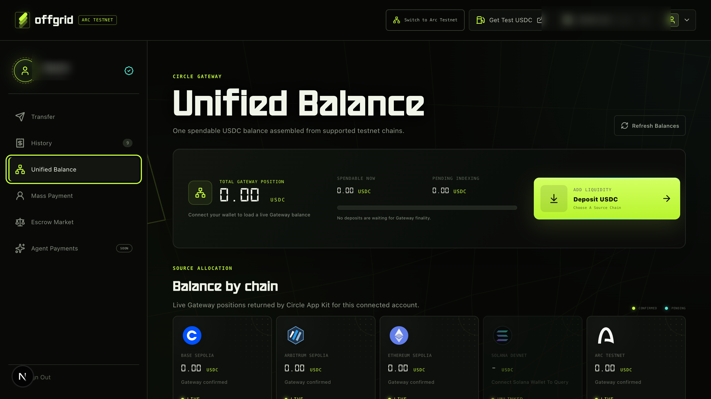
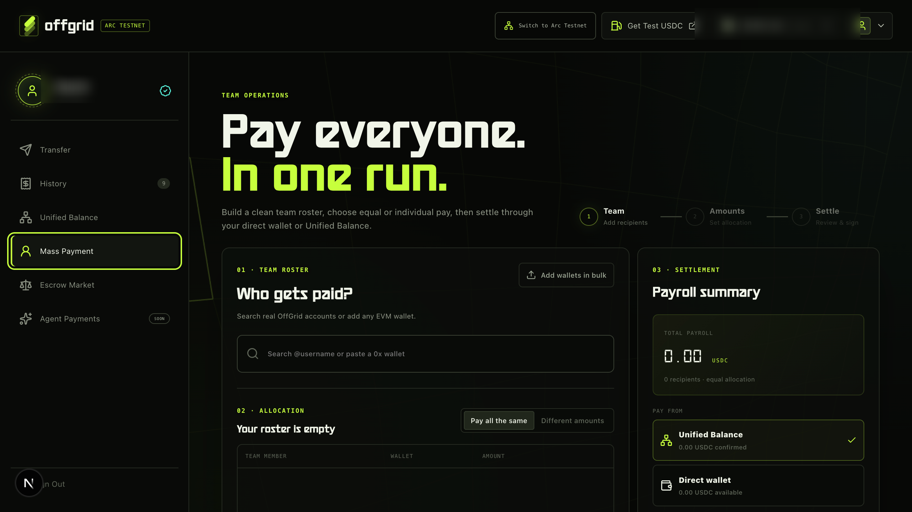
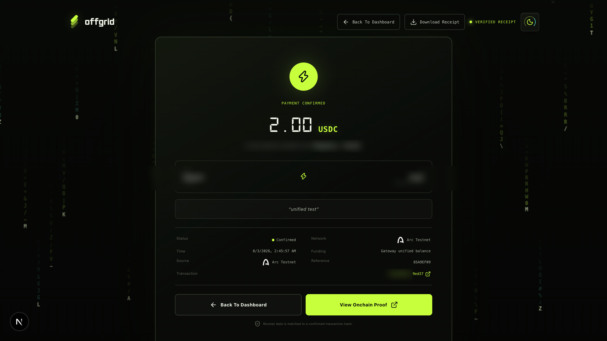

# OffGrid Product Walkthrough

This guide follows the same path a real testnet user takes through OffGrid. It explains what to click, what happens after each action, what counts as proof, and what data stays private.

If you prefer a guided recording, [request a video walkthrough](https://github.com/0xmugetso/off-grid/issues/new?title=Video%20walkthrough%20request&body=I%27d%20like%20a%20guided%20OffGrid%20walkthrough%20covering%3A%20%5Bfeature%20or%20flow%5D.). Include the feature or payment route you want to see.

> OffGrid is a testnet product. Use testnet tokens only. Fiat routes use Circle's sandbox and do not move real bank money.

Account names and wallet identifiers in the screenshots below are intentionally obscured.

## Before you begin

You will need:

- an EVM browser wallet such as Rabby or MetaMask;
- a small amount of testnet gas on any source network you want to use;
- testnet USDC from Circle's faucet;
- a second OffGrid account if you want to test a private payment session end to end;
- an optional Phantom, Solflare, or Backpack wallet for Solana Devnet flows.

Start at the [live testnet app](https://off-grid-theta.vercel.app/).

## 1. Create or reopen your account

New users land on the registration view. OffGrid suggests a short username automatically. Keep it or use the regenerate button until you find one you like, then connect an EVM wallet and sign the login message.

The signature is an authentication proof, not a blockchain transaction. It does not spend gas or move funds. Returning users can choose **Sign In** and prove ownership of the same wallet again.

> **Privacy:** OffGrid does not store a password or wallet key. The server verifies a one-time SIWE message and creates a signed `HttpOnly`, `SameSite=Lax` session cookie. Authentication nonces expire and cannot be reused.

## 2. Prepare your testnet wallets

After sign-in, the header shows the connected EVM wallet and the account menu.

1. Select **Switch To Arc Testnet** if the wallet is connected to another network.
2. Select **Get Test USDC** to open Circle's faucet.
3. Fund the networks you intend to test and keep enough native gas for source-chain actions.
4. Open the profile menu to connect an optional Solana Devnet wallet.

An EVM wallet owns the OffGrid account. A connected Solana wallet is an additional payment signer and cannot replace the EVM login identity.

## 3. Understand the dashboard

The Transfer dashboard has three useful layers:

- **Payment Session:** opens a private, two-person agreement before either side settles.
- **Live Balances:** reads the connected Arc Testnet wallet and confirmed Circle Gateway position.
- **Payment Console:** prepares a direct, Gateway, CCTP, or sandbox-assisted transfer.

Balance cards show live reads, loading states, or a clear unavailable state. They do not invent a value when a provider or RPC call fails.

## 4. Send a direct payment

Use the payment console when you already know who should receive the funds.

1. Search for an OffGrid username or paste an EVM address.
2. Enter the USDC amount.
3. Choose the funding source.
4. Add an optional memo.
5. Review the settlement path.
6. Confirm the wallet request when one is required.

The available funding sources are:

| Funding source | What happens | Completion proof |
| --- | --- | --- |
| **Direct Wallet** | The connected Arc Testnet wallet sends USDC | Confirmed transaction hash |
| **Unified Balance** | Circle Gateway spends confirmed USDC from the unified position | Gateway operation and destination transaction |
| **CCTP Bridge** | App Kit burns USDC on the chosen source testnet and mints it on Arc Testnet | Source burn, Circle attestation, and destination mint |
| **Fiat To Web3** | Circle Mint sandbox records the fiat-side event and a funded developer wallet sends testnet USDC | Sandbox references and final testnet transaction hash |

A rejected wallet prompt or failed route check is not a transfer. OffGrid adds an item to History only after a transaction or provider operation has actually been submitted.

## 5. Open a private payment session

Payment sessions let two people agree on one amount while choosing their own payment rails.

### Create the session

1. Select **Create Payment Session**.
2. Choose whether you are paying or receiving.
3. Set the amount and your preferred method.
4. Review the locked terms.
5. Create the session and copy its exact private URL.

### Invite the other person

Send the link to the intended counterparty. They must sign in before opening the session. The first eligible account to accept the invitation becomes the counterparty. Once claimed, unrelated accounts cannot enter.

The second person chooses how to pay or receive. Both screens refresh as choices are locked, payment begins, provider evidence arrives, and settlement completes. The dashboard notification appears only when the state advances, so reopening or refreshing the page does not create repeated alerts for the same event.

> **Privacy:** The URL contains a random 256-bit capability token. It does not contain the amount, identities, direction, or rail choices. Session lookup uses a SHA-256 hash. The raw capability remains server-side so the creator can reopen the exact link, while all payment terms stay in server-side storage.

### What each rail combination does

#### Web3 To Web3

After both choices are locked, the payer is taken to a prefilled payment console. The payer can use a direct Arc Testnet transfer, Unified Balance, or a supported CCTP route. The session completes only after the onchain proof is confirmed.

#### Web3 To Fiat

The payer sends testnet USDC to the Circle Mint deposit destination shown by OffGrid. The app verifies the onchain deposit, waits for Circle's sandbox credit, and then records the simulated payout to the receiver's linked sandbox bank destination. The session keeps each provider ID beside the source transaction proof.

#### Fiat To Web3

The payer starts a Circle sandbox wire. OffGrid waits for the sandbox deposit proof, then uses the configured, pre-funded developer-controlled wallet to send real testnet USDC to the receiver's wallet. The final step is verified from the destination transaction hash.

#### Fiat To Fiat

Circle's sandbox represents the incoming wire and outgoing bank redemption. No real bank money moves, and there may be no recipient blockchain transaction. OffGrid must receive provider references for the applicable deposit and payout stages before showing the session as complete.

## 6. Read and recover transaction proof

History is the audit view for submitted activity. Use it to:

- search by participant, route, or transaction ID;
- filter and sort activity;
- open a source or destination transaction in the appropriate explorer;
- inspect Circle sandbox, Gateway, and CCTP references;
- restore a missing CCTP transfer with its source burn hash;
- restore a missing Gateway deposit with its source network, amount, and deposit hash.

Pending CCTP and Gateway operations remain here across refreshes. Completed background items leave the active tracker after a short display period, while their permanent ledger record remains available.

For participant-facing text, OffGrid replaces the signed-in account's name with **You** where possible. This makes payment direction easier to understand without changing the stored proof.

## 7. Build a Unified Balance

Circle Gateway combines confirmed USDC positions from supported testnets into one spendable amount.

1. Open **Unified Balance**.
2. Select **Deposit USDC**.
3. Choose Base Sepolia, Arbitrum Sepolia, Ethereum Sepolia, Solana Devnet, or Arc Testnet.
4. Enter an amount and review the source wallet request.
5. Follow the deposit in History while Circle waits for the source chain's required finality.
6. Refresh balances after Gateway credits the deposit.

The source transaction can confirm before the Gateway balance changes. During that window, OffGrid shows the source proof and explains that Circle is still indexing or waiting for finality. Creating another deposit does not replace the first deposit's tracking state.

When spending, App Kit works from the confirmed unified position and selects eligible source balances for the route. OffGrid does not manually invent a deduction order.

> **Privacy:** Public wallet addresses and transaction hashes are visible on their testnet explorers. OffGrid keeps provider credentials on the server and never asks for a seed phrase or private key.

## 8. Run a mass payment

Mass Payment is designed for payroll and team disbursements.

1. Add verified OffGrid users or paste valid EVM wallet addresses.
2. Use **Add Wallets In Bulk** for a `name, wallet, amount` list.
3. Choose one equal amount or individual amounts.
4. Select Direct Wallet or Unified Balance.
5. Review the recipient count and total.
6. Sign and follow every recipient independently.

Compatible wallets may receive an EIP-5792 batch request. Other wallets use a guided sequence of ordinary transfers. Gateway payments submit one documented spend for each recipient. A partially completed run stays partial until every required proof is present.

## 9. Post or accept protected work

The Escrow Market follows the RefundProtocol lifecycle and adds a marketplace around it.

### Post a job

1. Select **Post A Job**.
2. Keep it public for the marketplace or enable a private invitation.
3. Add the title, scope, deliverables, and amount.
4. Review the agreement before publishing.

### Complete the agreement

1. A verified worker accepts the job.
2. The client funds the protected payment path.
3. Circle developer-controlled smart contract accounts deploy and fund RefundProtocol on Arc Testnet.
4. The worker uploads evidence for the agreed deliverables.
5. The configured validator records a confidence result.
6. Approved work releases testnet USDC to the beneficiary path. A valid refund action returns it through the depositor path.

Open **My Escrows** to continue active work or inspect completed agreements. The protocol inspector keeps the contract, payment reference, transaction hashes, evidence digest, validation result, and audit trail in one place.

> **Privacy:** Private listings are restricted to the invited account. Evidence creates a verification record, so do not upload personal, confidential, or production material to this testnet prototype.

## 10. Share the final receipt

A completed flow produces one receipt for both participants. It includes the amount, route, timestamp, payment reference, and strongest available proof.

- **View Onchain Proof** opens the explorer when a blockchain transaction exists.
- **Download Receipt** saves a clean image with a useful filename.
- **Back To Dashboard** returns to the workspace.
- The receipt URL can be shared with the other participant.

Sandbox-only fiat receipts display provider references instead of claiming an onchain transaction that does not exist.

## A practical test plan

Use two browser profiles or two browsers so each participant has a separate signed-in account.

| Test | Expected result |
| --- | --- |
| Register and sign in | Account opens after a SIWE signature with no gas spend |
| Direct wallet payment | Receiver balance changes and the receipt links to a confirmed hash |
| Private Web3 session | Both users see choice updates, settlement, and the same receipt |
| Gateway deposit | Source hash persists while pending, then the confirmed unified balance changes |
| Unified Balance payment | Gateway proof and destination transaction appear in History |
| CCTP transfer | Burn, attestation, and mint remain visible across refreshes |
| Fiat To Web3 | Sandbox wire proof is followed by a real testnet wallet payout |
| Web3 To Fiat | Testnet deposit proof is followed by a sandbox bank payout reference |
| Mass payment | Every recipient gets an independent state and receipt |
| Protected work | Contract deployment, funding, evidence, and release or refund remain auditable |

## If a flow is waiting

- Confirm the wallet is on the source network shown in the route.
- Confirm the source wallet has both USDC and native gas.
- Open History and refresh the specific proof instead of submitting the same action again.
- Expect Gateway deposits to wait for source-chain finality before Circle credits them.
- Use the recovery controls only with a real source transaction hash.
- For fiat sandbox routes, confirm the Circle Mint variables and developer wallet funding are configured on the server.

If a provider is delayed, OffGrid should remain pending and explain the current checkpoint. A waiting state is safer than displaying success without proof.

## Keep exploring

- [Return to the project README](README.md)
- [Read the architecture and trust boundaries](docs/ARCHITECTURE.md)
- [Review the payment session rail matrix](docs/PAYMENT_SESSION_RAILS.md)
- [Inspect the escrow implementation](docs/ARC_ESCROW.md)
- [Configure the fiat sandbox](docs/FIAT_SANDBOX.md)
